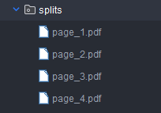

<div align=center>

# PDF Toolkit 2

</div>

<div align=center>
  <a href="#features"> ⚡️ Features | </a>
  <a href="#instalation"> 🛠️  Installation | </a>
  <a href="#usage"> 🚀 Usage | </a>
  <a href="#examples"> 🖼️ Examples | </a>
  <a href="#extract_metadata"> 📋 Extract Metadata | </a>
  <a href="#extract_image"> 🖼️ Extract Image | </a>
  <a href="#split_files"> 📁 Split Files | </a>
  <a href="#merge_files"> 📑 Merge Files  | </a>
  

</div>

<hr/>

##### 🌟 About

iText is a library that is primarily used to create and manipulate PDF documents from scratch, but it is not a PDF document editing tool in the sense of opening an existing PDF and making direct changes to its content, such as editing text or images in an already created PDF. However, you can use iText to perform certain manipulation operations on an existing PDF, such as adding additional content, replacing pages, adding annotations, extracting text, and more. [here](https://itextpdf.com/resources/api-documentation).

Follow the instructions and options outlined below to unlock the full potential of this PDF Toolkit 2.

<hr/>


<div id="features"></div>

#### ⚡️ Features

First we will create a database that will contain all the synchronization tables, if this already exists skip to the next step.

| Feature                               | Class Used (iText)   | Method used |
|-------------------------------------- |-----------------------|------------|
| Extract Text                          | `PdfDocument`|   `getTextFromPage`|
| Extract Images                        | `PdfDocument`|    `getImages`|
| Extract Metadata                      | `PdfDocument`|    `getInfo`|
| Split Files                           | `PdfDocument`|     `getImportedPage`       |
| Merge Files                           | `PdfDocument`|    `PdfReader`      |


<hr/>

<div id="instalation"></div>

#### 🛠️ Installation

Clone the Repository: Start by cloning the project repository to your local machine. Use the following command:

```
git clone git@github.com:felixsuarez0727/pdf-toolkit.git
```


<div id="usage"></div>

#### 🚀 Usage

Once you have cloned the repository and installed the necessary requirements, you can start using the PDF Toolkit 2 pdfs are handled within the project with the sample paths there are pulled and saved.

Make sure you use JDK java 8 and I leave you the development dependencies with Java and Gradle:

```
    implementation 'com.itextpdf:itextpdf:5.5.13.3'
    implementation group: 'org.apache.poi', name: 'poi', version: '5.0.0'
    implementation group: 'org.apache.poi', name: 'poi-ooxml', version: '5.0.0'
```


<div id="examples"></div>

#### 🖼️ Examples


Select an option


Put the example route


<div id="extract_image"></div>

#### 🖼️ Extract Image

Step 1


Step 2


Step 3


<div id="extract_metadata"></div>

#### 📋 Extract Metadata


Extracted metadata from pdf


<div id="split_files"></div>

#### 📁 Split Files
Step 1


Step 2


Step 3


result





<div id="merge_files"></div>

#### 📑 Merge Files

Step 1


Step 2


Step 3


Result


